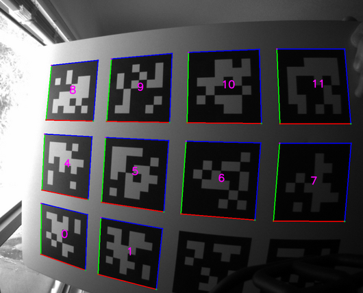

# ROS Apriltag Detector



This repository holds the following ROS2 packages for detecting and displaying [Apriltags](https://april.eecs.umich.edu/software/apriltag):

  - [apriltag_detector](./apriltag_detector/README.md): base class definitions for plugable detector libraries,
    launch files for detecting and displaying apriltags. This is the package typically used.

  The following packages are accessed mostly through the above [apriltag_detector](./apriltag_detector/README.md) package.

  - [apriltag_draw](./apriltag_draw/README.md): components for drawing detected Apriltags onto images.
  - [apriltag_umich](./apriltag_detector_umich/README.md): plugable library and component for detecting Apriltags using the
    UMich implementation.
  - [apriltag_mit](./apriltag_detector_mit/README.md): plugable library and component for detecting Apriltags using the
    MIT implementation.

The software in this repository does strictly perception, *no camera pose estimation*!
It is typically used when no camera calibration is available, or is not needed.
If you want perception and camera pose together, use [this package](https://github.com/christianrauch/apriltag_ros),
which uses the same tag message format.

## Installation

### From packages

```
apt install ros-${ROS_DISTRO}-apriltag-detector ros-${ROS_DISTRO}-apriltag-draw \
            ros-${ROS_DISTRO}-apriltag-detector-umich ros-${ROS_DISTRO}-apriltag-detector-mit
```

### From source

The build instructions follow the standard procedure for ROS2. Set the following shell variables:

```bash
repo=apriltag_detector
url=https://github.com/ros-misc-utilities/${repo}.git
```
and follow the ROS2 build instructions [here](https://github.com/ros-misc-utilities/.github/blob/master/docs/build_ros_repository.md)

Make sure to source your workspace's ``install/setup.bash`` afterwards.

## License

This software is issued under the Apache License Version 2.0.
