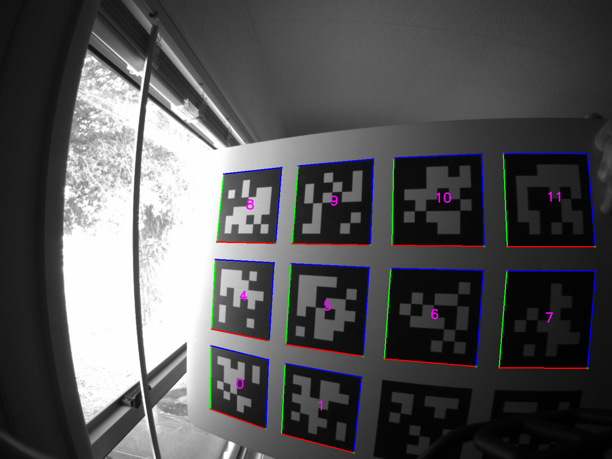

# ROS Apriltag detector package



This repository has ROS/ROS2 nodes and nodelets/components for
detecting Apriltags using the [Apriltag 3](https://github.com/AprilRobotics/apriltag) library.

## Supported platforms

Currently builds under Ubuntu 22.04 with ROS2 Humble or later.

## How to build
Create a workspace (``~/ws``), clone this repo, and use ``vcs``
to pull in the remaining dependencies:

```bash
pkg=apriltag_detector
mkdir -p ~/$pkg/src
cd ~/ws
git clone https://github.com/ros-misc-utilities/${pkg}.git src/${pkg}
```

On ROS1 you also need the messages package:

```bash
cd src
vcs import < ${pkg}/${pkg}.repos
cd ..
```

Install all system packages that this package depends on:

```bash
rosdep install --from-paths src --ignore-src
```

### configure and build on ROS1:

```bash
catkin config -DCMAKE_BUILD_TYPE=RelWithDebInfo  # (optionally add -DCMAKE_EXPORT_COMPILE_COMMANDS=1)
catkin build
```

### configure and build on ROS2:

```bash
cd ~/ws
colcon build --symlink-install --cmake-args -DCMAKE_BUILD_TYPE=RelWithDebInfo  # (optionally add -DCMAKE_EXPORT_COMPILE_COMMANDS=1)
```

## How to use

Examine the launch file and adjust the topic remapping, tag family
etc. Then start as follows (assuming your camera publishes under /my_camera_name/image_raw):

ROS1:
```
roslaunch apriltag_detector node.launch camera:=my_camera_name
rqt_image_view
```
The detector publishes a debug image and a tag topic.


ROS2:
```
ros2 launch apriltag_detector node.launch.py camera:=my_camera_name
ros2 run rqt_image_view rqt_image_view
```

Parameters:

- ``tag_family``. Apriltag family, something like "tf36h11".
- ``max_hamming_distance``. Maximum allowable hamming distance
  (defaults to 0).
- ``decimate_factor``. By how much to decimate the image to speed up
  detection. Defaults to 1 (no decimation). To half the resolution,
  use ``decimate_factor=2``.
- ``blur``. Gaussian blur to apply. Defaults to 0 (no blur). Can be
  negative to sharpen.
- ``image_qos_profile``. QoS profile of image messages that are subscribed to. Defaults to ``default``, but can also be set to ``sensor_data``. Use this parameter to achieve QoS compatibility when subscribing to image data.
- ``num_threads``. Number of threads on which the Apriltag library
  will operate. Defaults to 1.


## License

This software is issued under the Apache License Version 2.0.
